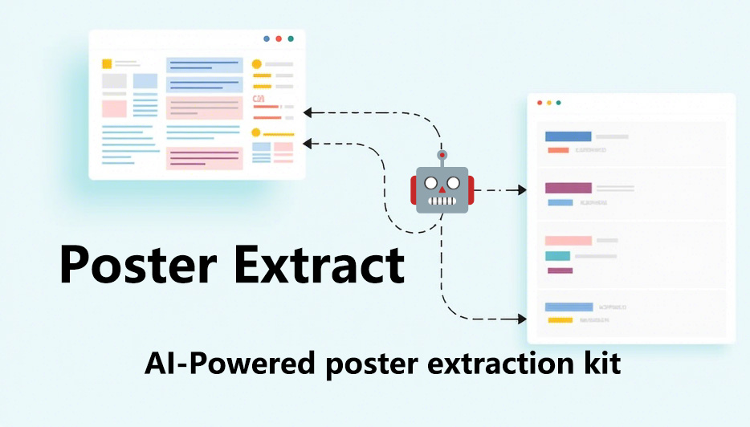

# 海报信息提取

## 项目描述 📋

欢迎使用**海报信息提取**！这个工具旨在通过上传文档图片，自动提取结构化信息，并生成Hugo页面。它使用Gradio构建用户界面，方便用户上传图片并查看提取结果。

## 功能特性 🌟

- **图片信息提取**：从海报中提取标题、简介、摘要、地点、日期和作者信息。
- **Hugo页面生成**：根据提取的信息自动生成Hugo页面模板，并保存为Markdown文件。
- **实时预览**：提供提取信息的实时预览，方便用户查看和验证。

## 技术栈 🛠️

- **Gradio**：用于构建用户界面，支持图片上传和结果展示。
- **Dashscope**：用于多模态对话，提取文档信息。
- **Hugo**：静态站点生成器，用于生成页面模板。

## 安装与使用 🚀

### 安装依赖

```bash
pip install -r requirements.txt
```

### 配置API密钥

将您的Dashscope API密钥保存到`API_KEY.txt`文件中。该API由阿里云提供，请[在这里](https://bailian.console.aliyun.com)查看更多信息。

### 运行应用

```bash
python main.py
```

### 使用步骤

1. 打开Gradio界面。
2. 上传文档图片。
3. 查看提取的信息和生成的Hugo页面。
